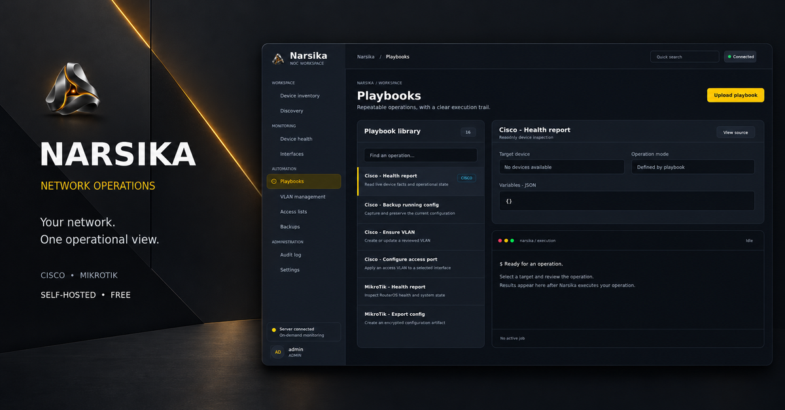
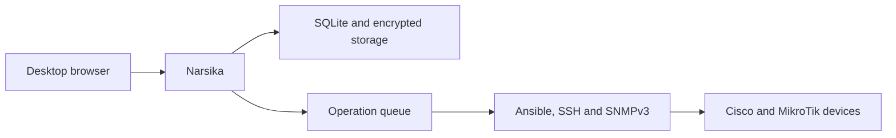

# Narsika

<p align="center">
  
</p>

<h3 align="center">Your network. One operational view.</h3>

<p align="center">
  A focused, self-hosted workspace for operating Cisco and MikroTik networks.
</p>

<p align="center"><strong>Public Beta · Free to use, always.</strong></p>



## Network operations without the operational clutter

Narsika brings device inventory, live checks, configuration backups, network automation, access control, and operational history into one desktop web workspace.

The current release is the **Narsika Public Beta**: a working product for teams that want a focused operational layer for Cisco and MikroTik environments while the platform continues to grow.

It is designed for network teams that need a practical tool they can install on their own infrastructure and understand from end to end—without deploying a large monitoring stack or maintaining a collection of disconnected scripts.

Every new installation starts clean. Narsika does not create demonstration devices, simulated telemetry, fake backups, or sample execution results. What you see comes from the Narsika database or your actual network equipment.

## What you can do with Narsika

### Organize your network

- Manage Cisco IOS, Cisco IOS XE, and MikroTik RouterOS devices.
- Keep devices in a searchable inventory with logical groups.
- Assign reusable SSH and SNMPv3 credential profiles.
- Store device model, management address, ports, and operational notes.
- Discover IPv4 hosts within explicitly allowed management ranges.

### Observe device state

- Run live, on-demand health checks against selected devices.
- Inspect reachability, identity, uptime, CPU, memory, and platform facts when available.
- Read interface state and SNMPv3 traffic counters.
- Keep unavailable values honest: missing measurements are displayed as **N/A**, never invented.

### Protect configuration state

- Capture encrypted Cisco and MikroTik configuration backups.
- Download retained backups and compare configuration versions.
- Preserve checksums, timestamps, device ownership, and audit context.
- Create backups manually before making operational changes.

### Automate repeatable work

- Use a reusable Ansible Playbook library for Cisco and MikroTik operations.
- Upload and replace custom Playbooks as an administrator.
- Let operators execute active Playbooks without granting upload permission.
- Review supported operations before applying them to a device.
- Create Cisco ACL entries and add reviewed MikroTik firewall rules.
- Manage Cisco VLAN operations through the same controlled execution path.
- Track queued, running, successful, failed, and cancelled operations.
- Retain sanitized task events, result history, and generated artifacts.

### Control access

- Create and manage internal Narsika accounts.
- Enforce permissions on the server—not only in the interface.
- Audit authentication, administration, and network operations.
- Revoke existing sessions after account or access changes.

## Internal roles

Narsika permissions belong to Narsika accounts. Ubuntu and Windows usernames are not mapped to product access.

| Role | Intended access |
|---|---|
| **ADMIN** | Manage users, settings, devices, credentials, Playbook uploads, and all operations |
| **OPERATOR** | Monitor devices and run existing Playbooks, backups, VLAN, and ACL operations |
| **VIEWER** | View inventory, monitoring results, backups, run history, and audit records |

Anyone who can reach the Narsika web address can open the sign-in page. Their internal role determines what they can view or change after authentication.

## How it is built

| Layer | Technology |
|---|---|
| Backend | Python 3.12+ and Flask |
| Interface | Jinja templates, custom CSS, and Vanilla JavaScript |
| Database | SQLite with WAL mode |
| Authentication | Flask-Login with internal role enforcement |
| Automation | Ansible Core |
| Device access | SSH, Netmiko, Ansible network CLI, and SNMPv3 |
| Application server | Gunicorn |
| Native Linux service | systemd |
| Windows runtime | Docker Desktop with WSL2 |

Narsika uses a compact single-server architecture. It does not require Redis, Celery, Node.js, React, Tailwind, or an external database. Monitoring work is performed on demand while the relevant workspace is active.



## Install on Ubuntu

Native installation on **Ubuntu 24.04 or newer, x64** is the primary deployment method. Both Ubuntu Desktop and Ubuntu Server are supported.

### Before you begin

You need:

- Ubuntu 24.04 or a newer Ubuntu release on x64;
- an internet connection during installation;
- a user with `sudo` access;
- at least 2 GiB of free disk space;
- network connectivity from the Ubuntu host to the devices you want to manage.

You do not need to install Python, pip, Ansible, Gunicorn, SSH tools, or UFW manually.

### Run the installer

Download and fully extract Narsika, open a terminal inside the extracted directory, and run:

```bash
bash run_linux.sh
```

The installer checks the host, installs missing requirements, creates an isolated Python environment, prepares private storage, configures the firewall, installs the systemd service, starts Narsika, and verifies application health.

During setup, you choose:

- the HTTP port, with `8000` as the default;
- the IPv4 management networks allowed to reach the platform.

Narsika uses the existing address of the Ubuntu host. It does not change the host IP address, DHCP configuration, DNS, routes, or network interfaces.

After installation, the terminal displays an address similar to:

```text
http://192.168.10.20:8000
```

Open the displayed address from one of the allowed management networks.

### If installation stops

If a download times out or an older installer reports that `runuser` is missing, extract the latest source into a new directory and rerun `bash run_linux.sh` there. The current installer includes administrative command paths, checks installed tools again after package installation, and gives pip downloads a 120-second timeout with ten retries. Internet access to the package repositories is still required. Existing Narsika data and keys are preserved; do not delete `/var/lib/narsika` or `/etc/narsika` when retrying.

### Service commands

```bash
sudo narsika-admin status
sudo narsika-admin logs
sudo narsika-admin restart
sudo narsika-admin stop
sudo narsika-admin start
```

### Create a platform backup

```bash
sudo narsika-admin backup
```

The platform backup contains the database, private configuration, encryption keys, uploaded Playbooks, encrypted device backups, execution artifacts, and trusted SSH host records. Store exported platform backups securely.

### Upgrade an existing installation

Extract the new release into a separate directory, then run:

```bash
sudo narsika-admin upgrade /absolute/path/to/new/narsika
```

The upgrade process preserves existing users, data, credentials, private storage, and encryption keys.

## Install on Windows

Narsika runs on Windows through a managed Linux environment. The recommended method uses **Docker Desktop with the WSL2 backend**. Windows Python and pip are not required.

### Before you begin

You need:

- an updated 64-bit installation of Windows 10 or Windows 11;
- hardware virtualization enabled in firmware;
- administrator permission for WSL and Docker setup;
- an internet connection during installation.

### Run the Windows launcher

1. Download and fully extract the Narsika ZIP.
2. Open the extracted directory.
3. Double-click **run_windows.bat**.
4. Approve administrator prompts when requested.
5. Complete Docker Desktop setup if the launcher opens it.
6. Restart Windows if requested.
7. Run **run_windows.bat** again after the restart.

The launcher checks WSL2 and Docker Desktop, installs missing prerequisites, builds the Narsika runtime, creates persistent storage, provisions the first administrator, starts the platform, waits for a healthy response, and displays the application address.

### Native WSL2 alternative

To install the Ubuntu service directly inside WSL2, open Command Prompt in the extracted directory and run:

```text
run_windows.bat -WSL
```

Complete the Ubuntu first-launch setup if Windows requests it, then run the command again. A recent WSL2 installation with systemd support is required.

## First sign-in

The first administrator username is:

```text
admin
```

During installation, Narsika generates a strong random temporary password and displays it once in the terminal. Copy that password and use it for the first sign-in.

Before the administrator can continue, Narsika requires a new password and confirmation. There is no default `admin/admin` credential, and the database stores only password hashes.

Administrators can create additional accounts from **Settings → Users**. Every new or reset account receives a random temporary password that is shown once and must be changed at the next sign-in.

If the administrator password is lost on Linux, reset it locally with:

```bash
sudo narsika-admin reset-admin admin
```

## Add your first device

1. Sign in as an administrator.
2. Open **Settings → Credentials**.
3. Create an SSH credential profile using a password or private key.
4. Open **Inventory** and add a Cisco or MikroTik device.
5. Assign its credential profile and connection ports.
6. Use the shield action to read the device SSH fingerprint.
7. Compare the fingerprint with a trusted source and approve it.
8. Open **Device Health** and request live device information.
9. Add an SNMPv3 profile if you need interface counters and traffic rates.
10. Capture a configuration backup before applying network changes.

Narsika never automatically trusts an unknown SSH host key.

## Security model

Narsika includes:

- random initial and reset passwords;
- mandatory password changes;
- scrypt password hashing;
- HttpOnly and SameSite session cookies;
- CSRF protection;
- sign-in attempt throttling;
- server-side role enforcement;
- session revocation after access changes;
- Fernet encryption for device credentials and private artifacts;
- explicit SSH host-key verification;
- private temporary Ansible inventory and variable files;
- sanitized execution events and audit history;
- management-network filtering during native installation.

The first release uses HTTP. Deploy it on a trusted management network and do not expose the application port directly to the public Internet.

---

<p align="center">
  <strong>Narsika</strong><br>
  Focused network operations for Cisco and MikroTik environments.
</p>
