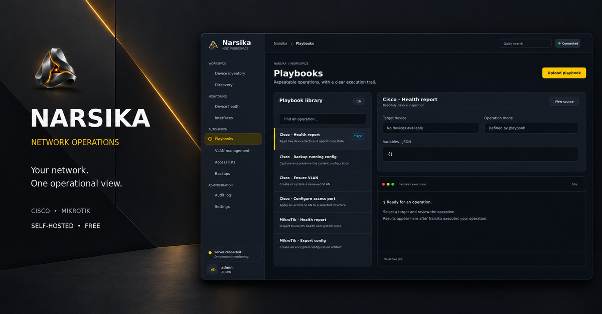
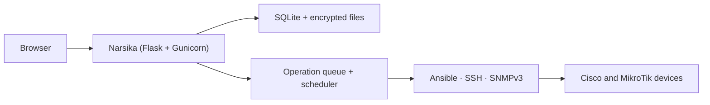

# Narsika

<p align="center">
  
</p>

<h3 align="center">Your network. One operational view.</h3>

<p align="center">
  A focused, self-hosted workspace for operating Cisco and MikroTik networks.
</p>

<p align="center"><strong>Public Beta · Free to use, always.</strong></p>

<p align="center">
  <a href="https://github.com/Ali-Moghanni-ir/Narsika/actions/workflows/validate.yml"></a>
  <a href="LICENSE"></a>
  
  
</p>



Narsika brings device inventory, live health checks, encrypted configuration backups, Ansible automation, reviewed firewall changes, scheduled tasks and a full audit trail into one desktop web workspace. You install it on your own server, it talks to your devices over SSH and SNMPv3, and nothing leaves your network.

It is built for network engineers and IT teams who want a practical tool they can understand end to end — without deploying a large monitoring stack or maintaining a folder of disconnected scripts.

**What you see is real.** A new installation starts empty. Narsika never creates demo devices, simulated telemetry, fake backups or sample results; a value that cannot be measured is shown as **N/A**.

## Features

| Area | What you get |
|---|---|
| **Inventory** | Cisco IOS / IOS XE and MikroTik RouterOS devices, groups, reusable SSH and SNMPv3 credential profiles, notes, and bounded IPv4 discovery of candidates in allowed ranges. |
| **Monitoring** | On-demand health (reachability, identity, uptime, CPU, memory), interface state and SNMPv3 traffic rates while the page is open. |
| **Backups** | Encrypted running-configuration backups with SHA-256 checks, download and side-by-side comparison. |
| **Automation** | A Cisco and MikroTik Ansible Playbook library with preview/apply mode, admin uploads, VLAN management and a persistent operation queue with live logs and cancellation. |
| **Firewall** | Read a device's IPv4 filter rules, stage Allow/Block changes, review the exact commands, take a mandatory backup, apply, and verify the result over a fresh SSH connection. Create new Cisco named extended ACLs. |
| **Schedules** | Run backups or Playbooks one time, every few hours, daily or weekly, with explicit time zones and per-occurrence history. |
| **Access control** | ADMIN, OPERATOR and VIEWER roles enforced on the server, forced password changes, session revocation and a searchable audit log. |

## Quick start

Download the source (**Code → Download ZIP**, or `git clone https://github.com/Ali-Moghanni-ir/Narsika.git`), extract it completely, and open a terminal in the extracted folder.

**Ubuntu 24.04 or newer (x64) — recommended**

```bash
bash run_linux.sh
```

The installer sets up everything it needs (Python environment, Ansible, systemd service, UFW rules), asks for the HTTP port and the management networks allowed to reach Narsika, and prints the address and a one-time administrator password.

**Windows 10/11 (x64)** — double-click `run_windows.bat`. It installs or reuses WSL2 and Docker Desktop and runs Narsika in a container. To install inside Ubuntu on WSL2 instead:

```text
run_windows.bat -WSL
```

**Docker on Linux**

```bash
bash run_linux.sh --docker
```

Sign in as `admin` with the password printed by the installer; you must choose a new password immediately. There is no default `admin/admin`.

Full requirements, mirrors for slow downloads, upgrades and troubleshooting: **[Installation guide](docs/INSTALLATION.md)**. Your first device, SSH trust and first backup: **[Getting started](docs/GETTING-STARTED.md)**.

## Documentation

| Guide | For |
|---|---|
| [Installation](docs/INSTALLATION.md) | Ubuntu, Windows, WSL2 and Docker installs, mirrors, first sign-in |
| [Getting started](docs/GETTING-STARTED.md) | Users and roles, first device, SSH host keys, health, backups, Playbooks |
| [Firewall](docs/FIREWALL.md) | Reviewed firewall changes on RouterOS and Cisco, risk levels, recovery |
| [Scheduled tasks](docs/SCHEDULES.md) | Recurring backups and Playbooks, statuses, limits |
| [Operations](docs/OPERATIONS.md) | Service commands, doctor, platform backup and restore, upgrades, HTTPS, configuration |
| [Playbook library](Playbooks/README.md) | Bundled Playbooks, variables and command-line use |
| [Architecture](docs/ARCHITECTURE.md) · [API](docs/API.md) · [Ansible dependencies](docs/ANSIBLE-DEPENDENCIES.md) · [Migration](docs/MIGRATION.md) | Developers and advanced operators |
| [Roadmap](docs/ROADMAP.md) · [Changelog](CHANGELOG.md) | What is planned and what changed |

## Roles

| Role | Access |
|---|---|
| **ADMIN** | Everything: users, settings, devices, credentials, Playbook uploads, all operations and high-risk firewall changes |
| **OPERATOR** | Monitoring, backups, existing Playbooks, VLAN operations, scheduled tasks they own and scoped firewall changes |
| **VIEWER** | Read-only: inventory, monitoring, backups, run history and audit records |

Roles belong to Narsika accounts; operating-system users are not mapped to them.

## How it is built

Python 3.12–3.14 and Flask, Jinja templates with custom CSS and vanilla JavaScript, SQLite in WAL mode, Ansible Core with Netmiko and SNMPv3 for device access, served by Gunicorn under systemd (or Docker on Windows). There is no Redis, Celery, Node.js build step or external database: one small server is enough.


```mermaid
flowchart LR
    U["Browser"] --> N["Narsika (Flask + Gunicorn)"]
    N --> D["SQLite + encrypted files"]
    N --> Q["Operation queue + scheduler"]
    Q --> A["Ansible · SSH · SNMPv3"]
    A --> E["Cisco and MikroTik devices"]
```

## Security

- Random one-time initial and reset passwords, mandatory password change, scrypt hashing and sign-in throttling.
- Server-side role checks, CSRF protection, HttpOnly/SameSite cookies and session revocation after access changes.
- Device credentials, backups, job parameters and artifacts encrypted at rest (Fernet).
- Unknown SSH host keys are never trusted automatically; changed keys are rejected.
- Every device change goes through validation, the operation queue and the audit log.

Narsika serves plain HTTP by default. Run it on a trusted management network and never expose it directly to the Internet; see [HTTPS](docs/OPERATIONS.md#https-with-nginx) for a reverse-proxy setup. To report a vulnerability, follow [SECURITY.md](SECURITY.md).

## Project status

Narsika is in **public beta**. Every change runs the automated suite in CI on Python 3.12, 3.13 and 3.14, plus Docker and Windows installer checks. Health, backups and Playbooks have been used on MikroTik CHR, physical MikroTik and virtual Cisco devices. Device behaviour of the newest features — Firewall and scheduled tasks — still needs broader lab verification, so test changes on lab equipment with console access before using them in production.

Next up: a platform driver layer, Linux server support, persistent monitoring with alerts, and an AI assistant that proposes changes for human approval. See the [roadmap](docs/ROADMAP.md).

## Contributing

Bug reports and feature ideas are welcome in [Issues](https://github.com/Ali-Moghanni-ir/Narsika/issues). Before opening a pull request, read [CONTRIBUTING.md](CONTRIBUTING.md).

## License

Narsika is **source-available** under the [Functional Source License, Version 1.1, ALv2 Future License](LICENSE) (FSL-1.1-ALv2).

- You may use, study and modify Narsika for any purpose other than a *Competing Use*, including running it inside your organization, education, research and professional services for other Narsika users.
- A Competing Use means offering Narsika, or something that substitutes for it, as a commercial product or service.
- Each release becomes available under the Apache License 2.0 two years after it is published.

The Ansible callback plugin in `callback_plugins/` is licensed separately under GPL-3.0-or-later because it extends Ansible's plugin classes. Third-party dependencies keep their own licenses.

---

<p align="center">
  <strong>Narsika</strong><br>
  Focused network operations for Cisco and MikroTik environments.
</p>
