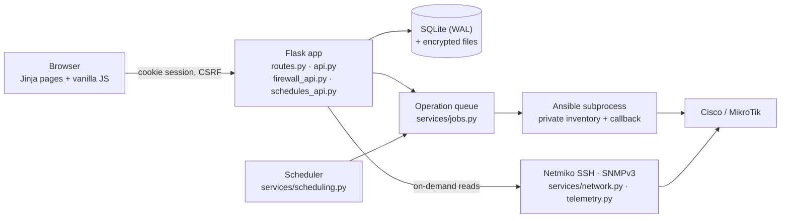

# Architecture

Narsika is a single-server Flask application. This document explains how its parts fit together and the rules each part relies on. For endpoint details see [API](API.md); for Ansible packaging see [Ansible dependencies](ANSIBLE-DEPENDENCIES.md).

## Overview

| Layer | Implementation |
|---|---|
| Web | Flask application factory (`app/__init__.py`), server-rendered Jinja pages, one custom stylesheet set and vanilla JavaScript modules. No SPA, build tool or CDN. |
| API | JSON under `/api` with a uniform envelope, cookie authentication and CSRF header. |
| Data | SQLAlchemy models on SQLite with WAL and foreign keys. |
| Work | An in-process job executor and scheduler; Ansible runs as a subprocess. |
| Devices | Netmiko over SSH for reads, Ansible `network_cli` for changes, pysnmp for SNMPv3. |

## Process model

- One Gunicorn worker process with **eight request threads** serves the web app.
- The same process runs a **two-thread operation executor** and the scheduler.
- A file lock (`worker.lock` in the data directory) ensures only one dispatcher runs per data directory. Never enable Gunicorn preload, reload, multiple workers or replicas against the same SQLite data.

This keeps installation to one service with no Redis, Celery or external database. The trade-off is a single-node design: capacity should be measured on the target network before scaling decisions.

## Request path and guards

Every request passes through guards in the application factory:

1. **Source allow-list** — clients outside `NARSIKA_WEB_NETWORKS` receive `403 SOURCE_NOT_ALLOWED`. Forwarded headers are ignored unless exactly one trusted proxy hop is configured.
2. **Session validity** — a disabled account or a changed `session_version` (password reset, role change) ends the session.
3. **CSRF** — every POST, PATCH and DELETE needs the `X-CSRFToken` header from the page's meta tag.
4. **Role check** — endpoints declare `require('read' | 'operate' | 'admin')`; the UI only mirrors these server-side checks.

Errors carry a request ID. Tracebacks are logged with locations only, never exception values that might contain secrets.

## Data model and migrations

`app/models.py` keeps the original `User`, `Group`, `Device` and `AuditLog` models and adds credential profiles, settings, audit events, operation runs, discovery runs, backups, artifacts, firewall reviews and scheduled tasks.

- Device secrets live in encrypted credential profiles; job parameters, backups, artifacts and firewall receipts are encrypted with the installation's Fernet key.
- Initialization is idempotent. Migrations are **additive only**: nothing is dropped. Before existing tables are changed, an authenticated, encrypted SQLite snapshot is written and verified.
- A database with a newer schema version than the code is refused.
- Legacy plaintext device passwords and raw audit output are moved into encrypted fields; `secure_delete`, `VACUUM` and WAL truncation remove the old bytes from the active database files.

See [Migration](MIGRATION.md) for importing older databases.

## Operation queue

`services/jobs.py` persists runs in SQLite (`PENDING → RUNNING → SUCCESS | FAILED | CANCELLED`, plus `INTERRUPTED` after a restart and firewall-specific outcomes).

- Submission order is preserved per device; other devices use free executor slots. Queue capacity is bounded (32 active or pending runs).
- Queued runs record the target's connection identity and the actor's session version; if either changes before execution the run fails (`TARGET_CHANGED`, `AUTHORIZATION_CHANGED`).
- Only a connection-lock failure *before* any network contact returns a run to the queue. Ambiguous or partially executed work is never replayed.
- Cancelling stops the Ansible process group; commands already accepted by a device are not undone.
- The health endpoint reports whether the dispatcher thread is alive, and new submissions are refused if it is not.

## Monitoring

Monitoring is **on demand**: samples are collected only while a monitoring page is visible, and there is no background telemetry daemon or stored history.

- Health uses real SSH commands through Netmiko; ICMP reachability and authenticated health are reported separately. Values a platform does not provide stay `null` (shown as N/A).
- Interfaces use SNMPv3 authPriv when a profile is assigned; otherwise Cisco output is parsed with TextFSM and RouterOS reports CLI link state.
- Rates need two valid counter samples; resets, restarts, discontinuities and long gaps are rejected.
- Concurrent viewers share a sample for up to four seconds. Cache identities include the target and credential, so changing either invalidates old samples.

## Discovery

Scans are limited to `NARSIKA_ALLOWED_NETWORKS` and `NARSIKA_SCAN_MAX_HOSTS` (≤ 256). An SSH banner only marks a candidate. Import requires a recent, authenticated verification of a Cisco or RouterOS identity; addresses already in inventory are skipped.

## SSH trust

Narsika keeps its own `known_hosts` in the data directory. Unknown keys are never accepted automatically; an administrator verifies and trusts a fingerprint, and a changed key is rejected until re-verified. The same file is used by Netmiko and by Ansible.

`ansible-pylibssh 1.4.0` does not consume the `config_file` argument that `ansible.netcommon 8.6.2` forwards, which caused trusted keys to be rejected. `tools/patch_ansible.py` applies a small, hash-checked adaptation that passes Narsika's `known_hosts` through the supported `knownhosts` argument. Host-key checking stays enabled, and the script refuses collection versions it does not recognise.

## Automation (Ansible)

- Each run gets a private temporary inventory and variables file, server-owned connection variables, host-key checking and a filtered environment. Secrets never appear in argv.
- Each job uses the release's own Ansible executable and a single `ANSIBLE_COLLECTIONS_PATH`, with system-path collection scanning disabled; inherited global Ansible overrides are discarded. Release paths are captured at import, so switching the `current` release does not affect a running worker.
- The `narsika_safe` callback emits only module names and state. Raw results, task names and secret-bearing output never reach the audit log.
- Persistent control sockets use a short private temporary directory to stay under Unix socket path limits.
- Uploaded Playbooks are **trusted administrator code**: YAML is validated, but there is no sandbox. A Playbook can use anything the service account can reach.
- Artifacts are collected from `narsika_artifact_root`, encrypted and kept even when a run fails or is cancelled.

## Firewall

`services/firewall.py` compiles firewall *intents* into device commands through a review pipeline:

1. **Read** — RouterOS `/ip firewall filter export terse`, or Cisco `show ip access-lists` plus the running configuration (for bindings and remarks). The parsed state has a fingerprint.
2. **Compile** — validated intents become commands, expected results and recovery commands, with a risk level (LOW, MEDIUM, HIGH, LOCKOUT) computed from the change and Narsika's management source.
3. **Receipt** — the plan is encrypted, checksummed and bound to the actor, session version, target identity, state fingerprint and a 10-minute expiry.
4. **Apply** (worker) — re-check authorization, target and fingerprint; take a mandatory encrypted backup; re-check the fingerprint; run a fixed internal Playbook (`services/firewall_playbooks/`) that stops at the first failed entry.
5. **Verify** — read the state again over a fresh SSH connection and compare it with the expected entries, placement and untouched baseline.

The generic `/api/automation/runs` endpoint cannot submit firewall jobs, and new `acl` runs are refused: every filter change goes through this pipeline.

## Scheduler

`services/scheduling.py` runs about once per second inside the dispatcher, which already holds the worker lock.

- Rules use `zoneinfo` with the OS `tzdata`. Daily and weekly rules follow wall-clock time in the chosen zone; interval rules advance by elapsed UTC hours.
- One SQLite transaction creates the occurrence, all target runs and the next due time, so an interruption leaves none of them.
- Missed windows produce a single `MISSED` record without replay; overlap and insufficient capacity are skipped explicitly.
- The scheduler never talks to devices; it submits normal Backup or Playbook runs, which the queue validates like any other run. Before execution, target fingerprints and the Playbook's source hash are checked against the task definition.

## Releases and packaging

- `tools/package_release.py` builds a release ZIP from an explicit whitelist of files and directories, with a SHA-256 manifest.
- Native installs are versioned under `/opt/narsika/releases/`; `/opt/narsika/current` points to the active one. Code and virtual environments are root-owned and read-only to the service account.
- The first administrator is created by an offline terminal bootstrap before the service starts. Gunicorn never accepts an initial password from the environment.
- Docker images pin the Python base image by digest and install the same checksum-locked collections.

## References

[Flask ProxyFix](https://flask.palletsprojects.com/en/stable/deploying/proxy_fix/) · [SQLite secure_delete](https://www.sqlite.org/pragma.html#pragma_secure_delete) · [Ansible libssh connection](https://docs.ansible.com/projects/ansible/latest/collections/ansible/netcommon/libssh_connection.html) · [Ansible network_cli](https://docs.ansible.com/projects/ansible/latest/collections/ansible/netcommon/network_cli_connection.html)
